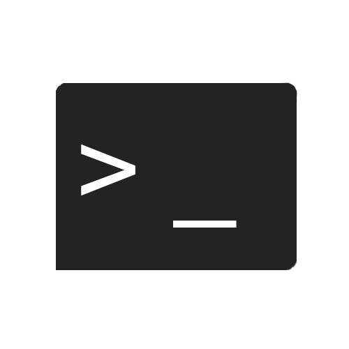

  

  # TermJS

  ###### Terminal emulation in javascript

TermJS is a simple terminal emulator made in javascript using [node.js](nodejs.org/), using the [child process](https://nodejs.org/api/child_process.html).

  

    Requirements
  

  - [NodeJs](nodejs.org)
  - [Child process](https://nodejs.org/api/child_process.html) (comes with nodejs)

  

    To-Do
  

  - [x] execute commands
  - [ ] make a visual terminal
  - [ ] interact with the HTML file
  - [x] make TermJS importable in other projects

  

    Installation
  

  1. download the `terminal.js`[[1]](https://github.com/garbageoverflow/TermJs/blob/main/app/terminal.js) file
  2. import it into your project
  `var terminal = require('./path/to/the/terminal')`
  3. run the only command available right now(more coming soon) `terminal.run('your-command')`
  4. now just run your javascript file using [nodejs](nodejs.org) `node your-file.js`
  5. now it will execute the command and log it.

